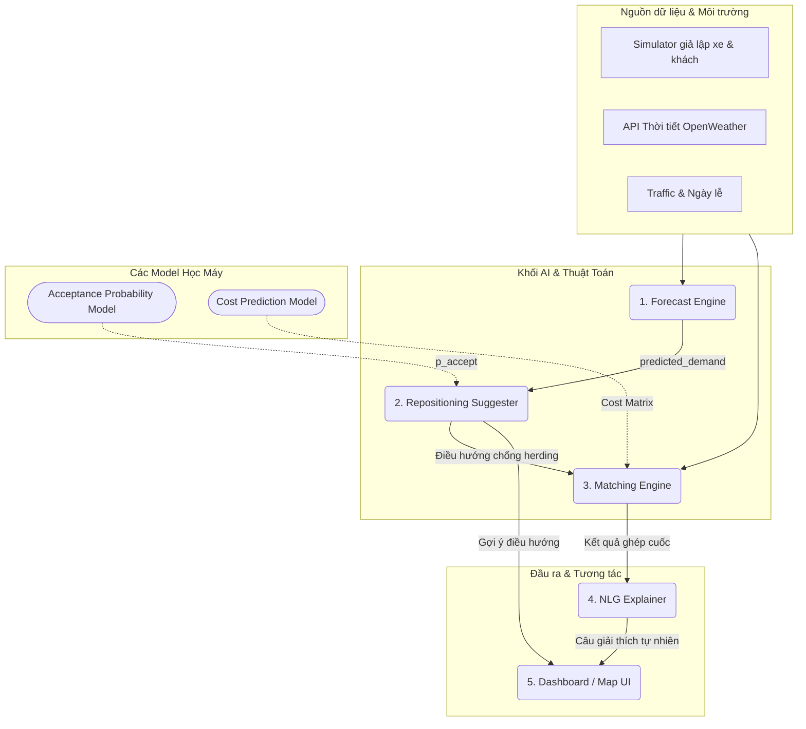
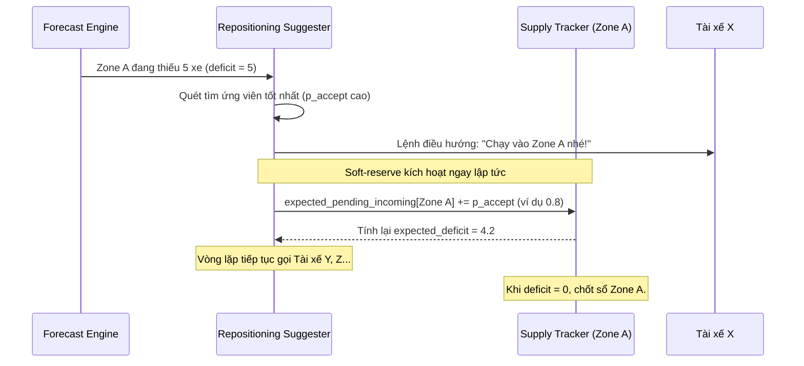
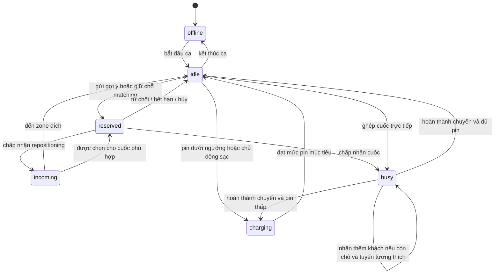

# Tài Liệu Đặc Tả Bài Toán & Thiết Kế Dữ Liệu (Week 1)

## Tổng Quan Kiến Trúc Hệ Thống (Architecture & Data Flow)


## 1. Phân chia bản đồ (Zoning)
Sử dụng hệ thống lưới lục giác **H3 (của Uber)** ở độ phân giải (resolution) mức 7.
- **Phạm vi PoC:** 30 zone H3 liền kề, bao phủ khoảng 169,55 km² quanh lõi đô thị Hà Nội. Resolution 7 được chọn để 30 zone vẫn bao phủ đủ rộng cho bài toán điều phối; đây không phải toàn bộ địa giới hành chính Hà Nội.
- **Dữ liệu zone:** `data/hanoi_zones.geojson` dùng để vẽ polygon trên bản đồ; `data/hanoi_zones.json` dùng cho simulator và backend.
- **Lý do chọn H3:** Phù hợp để chia khu vực, gom nhóm cung-cầu và tìm các zone lân cận.
- **Giới hạn:** H3 không biểu diễn mạng lưới đường bộ và không dùng để tính tuyến đường thực tế. Hệ thống dùng Google Routes API để lấy quãng đường, ETA và polyline theo đường bộ; khoảng cách Haversine chỉ dùng để lọc nhanh ứng viên và làm phương án dự phòng.

### 1.1. Phân loại chức năng zone cho simulator

30 zone được phân loại bằng tập luật khoảng cách tới các anchor đô thị đã cấu hình trong `data/generate_hanoi_zones.py`. Đây là nhãn giả lập có kiểm soát cho PoC, không phải dữ liệu quy hoạch sử dụng đất chính thức.

| `zone_type` | Số zone | Hệ số demand cơ sở | Pattern chính |
|---|---:|---:|---|
| `central_business` | 2 | 1.50 | Nhu cầu cao cả ngày |
| `office` | 6 | 1.35 | Cao điểm đi làm ngày thường |
| `residential` | 9 | 1.00 | Đi ra buổi sáng, trở về buổi tối |
| `commercial` | 4 | 1.25 | Buổi tối và cuối tuần |
| `university` | 3 | 1.15 | Theo giờ học |
| `transport_hub` | 2 | 1.45 | Theo đợt khách đến/rời bến, ga |
| `mixed_use` | 0 | 1.10 | Phân bố tương đối cân bằng; hiện chưa có zone được gán loại này |
| `peripheral` | 4 | 0.70 | Mật độ thấp |

Mỗi zone có thêm các trường `zone_type`, `classification_anchor`, `anchor_distance_km`, `base_demand_weight`, `peak_profile` và `classification_method`. Khi có dữ liệu POI hoặc dữ liệu vận hành thật, có thể thay bộ luật này mà không đổi H3 ID hay polygon của zone.

## 2. Định nghĩa Cấu trúc Dữ liệu (Data Schema)
Hệ thống sẽ giao tiếp giữa các module bằng các cục dữ liệu chuẩn JSON như sau:

### 2.1. Đối tượng Tài xế (Driver)
```json
{
  "driver_id": "D12345",
  "location": {"lat": 21.0285, "lng": 105.8542},
  "zone_id": "88411a3739fffff", 
  "battery_level": 85.5,
  "status": "idle",
  "destination_zone_id": null
}
```

`status` nhận một trong sáu giá trị: `idle`, `reserved`, `incoming`, `busy`, `charging`, `offline`. `destination_zone_id` có giá trị khi tài xế đã được giữ chỗ, đang đi tới một zone hoặc đang thực hiện chuyến.

### 2.2. Yêu cầu của Khách hàng (Rider Request)
```json
{
  "request_id": "R9876",
  "pickup_location": {"lat": 21.0300, "lng": 105.8500},
  "pickup_zone_id": "88411a3739fffff",
  "dropoff_location": {"lat": 21.0180, "lng": 105.8120},
  "dropoff_zone_id": "88411a371dfffff",
  "passenger_count": 1,
  "request_time": "2026-07-17T17:30:00Z",
  "status": "waiting"
}
```

### 2.3. Dữ liệu Ngữ cảnh (Context/Environment)
```json
{
  "timestamp": "2026-07-17T17:30:00Z",
  "weather": "rain",
  "is_holiday": false,
  "traffic_level": "high"
}
```

Trong PoC, thời tiết lấy từ OpenWeatherMap, ngày lễ lấy từ thư viện `holidays`, còn traffic dùng dữ liệu giả lập theo giờ/khu vực khi chạy thí nghiệm. Google Routes API chỉ được gọi cho các tuyến ứng viên hoặc lúc demo để lấy ETA có xét traffic thực tế.

### 2.4. Kết quả dự báo nhu cầu (Forecast Result)
```json
{
  "zone_id": "88411a3739fffff",
  "generated_at": "2026-07-17T17:30:00Z",
  "forecast_for": "2026-07-17T17:50:00Z",
  "horizon_minutes": 20,
  "predicted_demand": 35.2,
  "model_version": "demand-xgb-v1"
}
```

### 2.5. Trạng thái cung-cầu theo zone (Zone Supply Snapshot)
```json
{
  "zone_id": "88411a3739fffff",
  "timestamp": "2026-07-17T17:30:00Z",
  "idle_drivers": 18,
  "incoming_drivers": 4,
  "outgoing_drivers": 2,
  "predicted_supply": 20,
  "predicted_demand": 35.2,
  "deficit": 15.2
}
```

### 2.6. Gợi ý điều xe (Repositioning Suggestion)
```json
{
  "suggestion_id": "S1001",
  "driver_id": "D12345",
  "from_zone_id": "88411a371dfffff",
  "target_zone_id": "88411a3739fffff",
  "acceptance_probability": 0.81,
  "expected_road_distance_m": 3800,
  "expected_travel_time_seconds": 720,
  "reserve_status": "pending",
  "expires_at": "2026-07-17T17:31:00Z"
}
```

`reserve_status` nhận một trong các giá trị: `pending`, `accepted`, `rejected`, `expired`, `cancelled`.

### 2.7. Kết quả ghép chuyến dùng chung (Pooled Matching Result)
```json
{
  "match_id": "M5001",
  "driver_id": "D12345",
  "vehicle_capacity": 4,
  "occupied_seats_after_match": 2,
  "request_ids": ["R9876", "R9877"],
  "route_stops": [
    {"sequence": 1, "type": "pickup", "request_id": "R9876", "eta_seconds": 300},
    {"sequence": 2, "type": "pickup", "request_id": "R9877", "eta_seconds": 480},
    {"sequence": 3, "type": "dropoff", "request_id": "R9876", "eta_seconds": 900},
    {"sequence": 4, "type": "dropoff", "request_id": "R9877", "eta_seconds": 1080}
  ],
  "predicted_route_cost": 18.7,
  "max_detour_ratio": 0.18,
  "battery_feasible": true,
  "matched_at": "2026-07-17T17:30:05Z"
}
```

Một `driver_id` được gắn nhiều `request_id` trong cùng chuyến nếu tổng số hành khách không vượt sức chứa, mọi pickup xảy ra trước dropoff tương ứng, ETA đón không quá 10 phút và độ vòng đường của từng khách không quá 20% so với chuyến đi riêng.

### 2.8. Kết quả định tuyến đường bộ (Route Result)
```json
{
  "route_id": "RT9001",
  "origin": {"lat": 21.0285, "lng": 105.8542},
  "destination": {"lat": 21.0300, "lng": 105.8500},
  "provider": "google_routes",
  "distance_m": 2400,
  "duration_seconds": 480,
  "traffic_aware_duration_seconds": 540,
  "encoded_polyline": "sample_encoded_polyline",
  "calculated_at": "2026-07-17T17:30:02Z"
}
```

Quy trình tính đường:

1. Dùng Haversine để lọc top 3-5 tài xế gần mỗi khách.
2. Gọi Google Routes API cho các cặp ứng viên để lấy đường bộ và ETA thực tế.
3. Dùng `traffic_aware_duration_seconds` để chấm điểm các phương án chèn pickup/dropoff vào tuyến hiện tại.
4. Cache kết quả theo cặp zone trong thời gian ngắn để giảm số request và chi phí API.
5. Nếu routing API lỗi hoặc hết quota, fallback về Haversine nhân hệ số đường vòng và traffic giả lập.

## 3. Công thức tính Cung - Cầu cốt lõi

Hệ thống tính toán theo từng Zone và từng Tick (ví dụ 5 phút/lần).

- **Nguồn cung dự kiến (Predicted Supply):**
  `predicted_supply[zone, t] = idle_drivers + incoming_drivers - outgoing_drivers`
  *Trong đó:*
  - `idle_drivers`: Số xe rảnh đang đỗ sẵn trong zone.
  - `incoming_drivers`: Số xe đang trên đường đi tới zone này (do AI vừa điều hướng hoặc đang chở khách sắp trả ở đây).
  - `outgoing_drivers`: Số xe sắp rời khỏi zone này (vừa nhận cuốc đi zone khác).

- **Độ lệch Cung - Cầu (Deficit):**
  `deficit[zone, t] = predicted_demand[zone, t] - predicted_supply[zone, t]`
  *Nếu deficit > 0: Vùng này đang THIẾU xe (Cần ưu tiên điều hướng).*
  *Nếu deficit < 0: Vùng này đang THỪA xe.*

## 4. Cơ chế Chống dồn xe (Anti-Herding Soft-reserve)

**Sơ đồ khối (Flowchart):**


**Luồng hoạt động (Workflow) từng bước:**
1. AI phát hiện Zone A đang có `deficit = 5` (đang thiếu 5 xe).
2. AI quét tìm các tài xế rảnh xung quanh, tính toán `p_accept` và chọn được Tài xế X là ứng viên tốt nhất.
3. Gửi lệnh điều hướng cho Tài xế X chạy vào Zone A.
4. **Ngay lập tức (thực thi soft-reserve tạm thời):** 
   - `expected_pending_incoming[Zone A]` được cộng thêm `p_accept`; ví dụ `0.8`.
   - Tạo reservation có trạng thái `pending` và thời hạn phản hồi, ví dụ 60 giây.
   - Hệ thống tính lại nguồn cung và thiếu hụt kỳ vọng; với `p_accept = 0.8`, `expected_deficit` giảm từ 5 xuống 4,2.
5. Nếu tài xế chấp nhận, reservation chuyển thành `accepted` và tài xế chuyển sang trạng thái `incoming`.
6. Nếu tài xế từ chối, hết hạn hoặc hủy, reservation được giải phóng: bỏ `p_accept` tương ứng khỏi `expected_pending_incoming[Zone A]`; không thay đổi `incoming_drivers` vì tài xế chưa từng được xác nhận là đang tới zone. Hệ thống tính lại deficit và có thể chọn tài xế khác.
7. Vòng lặp tiếp tục với các tài xế tiếp theo cho đến khi deficit dự kiến bằng 0 hoặc không còn ứng viên phù hợp.

Soft-reserve chỉ giảm nguy cơ dồn xe trong phạm vi các gợi ý mà hệ thống đang quản lý; không khẳng định triệt tiêu hoàn toàn herding vì tài xế vẫn có thể đổi hướng, mất kết nối hoặc không tuân theo gợi ý.

## 5. Cấu hình quy mô và đơn vị mô phỏng đã chốt

Cấu hình máy đọc được đặt tại `data/simulation_config.json`. Quy mô dưới đây mô phỏng một phần hoạt động của lõi đô thị Hà Nội, không đại diện cho toàn bộ đội xe GSM ngoài thực tế.

| Tham số | Giá trị chốt | Lý do |
|---|---:|---|
| Số zone | 30 | Khớp bộ H3 zone của PoC |
| Số tài xế ban đầu | 300 | Trung bình 10 xe/zone; đủ chịu tải cao điểm nhưng vẫn tạo thiếu hụt cục bộ để đánh giá repositioning |
| Nhu cầu giờ bình thường | 300 yêu cầu/giờ | Khoảng 25 yêu cầu mỗi tick, đủ tạo cạnh tranh cung-cầu |
| Hệ số cao điểm sáng | 1,6 lần | Tạo khoảng 480 yêu cầu/giờ |
| Hệ số cao điểm chiều | 1,8 lần | Tạo khoảng 540 yêu cầu/giờ |
| Tick lập kế hoạch | 5 phút | Forecast và supply tracking chạy mỗi 300 giây |
| Rolling batch matching | 30 giây | Gom request mới và chèn vào tuyến của tài xế idle hoặc chuyến ghép còn chỗ |
| Sức chứa mặc định | 4 hành khách | Không tính tài xế; tổng `passenger_count` đang phục vụ không vượt ngưỡng này |
| Độ vòng đường tối đa | 20% | Bảo vệ trải nghiệm của từng khách so với đi riêng |
| Forecast horizon | 20 phút | Tương đương 4 tick, đủ thời gian repositioning trong nội đô |
| Ngưỡng pin thấp | Dưới 20% | Không nhận repositioning xa và ưu tiên về trạm sạc |
| Ngưỡng pin nguy cấp | Dưới 10% | Chỉ cho phép đi sạc hoặc hoàn tất tác vụ an toàn hiện tại |
| Soft-reserve TTL | 60 giây | Nếu không phản hồi thì giải phóng nguồn cung dự kiến |
| Khách hủy | Sau 10 phút | Request chưa được đón sau 600 giây được đánh dấu `cancelled` |
| Seed mặc định | `20260717` | Giúp A/B test có thể tái lập |

Tick 5 phút là chu kỳ ra quyết định, nhưng simulator vẫn lưu event bằng timestamp tới giây. Vì vậy soft-reserve 60 giây và thời điểm hủy chuyến không bị làm tròn theo tick.

Để bài toán chèn tuyến không tăng quá nhanh, hệ thống lọc top 5 tài xế ứng viên cho mỗi request bằng Haversine. Ứng viên gồm tài xế `idle` và tài xế đang có chuyến ghép còn chỗ; sau đó hệ thống mới lấy ETA đường bộ, thử các vị trí chèn pickup/dropoff hợp lệ và chọn phương án tăng chi phí tuyến ít nhất.

## 6. Nguồn dữ liệu đã chốt

| Dữ liệu | Nguồn sử dụng | Phạm vi |
|---|---|---|
| Weather | OpenWeatherMap | Lấy trạng thái thời tiết cho demo; snapshot được lưu cùng run để tái lập |
| Holiday | Thư viện Python `holidays` | Xác định ngày lễ Việt Nam |
| Routing demo | Google Routes API | Lấy đường bộ, polyline và traffic-aware ETA cho các cặp ứng viên được chọn |
| Traffic train/A/B | Simulator rule-based với random seed cố định | Dùng cho toàn bộ dữ liệu train và so sánh ba kịch bản |
| Zone | H3 resolution 8 | Polygon và phép gom nhóm cung-cầu |

Google traffic không được dùng để tạo toàn bộ training dataset. Lý do là chi phí, quota, giới hạn lưu trữ/tái sử dụng và khó tái lập thí nghiệm. Báo cáo phải tách rõ KPI từ simulator với minh họa traffic thật trong demo.

## 7. Quy ước contract giữa Business/AI và Platform

### 7.1. Quy ước chung

| Nội dung | Quy ước bắt buộc |
|---|---|
| Tên field | `snake_case`, tiếng Anh |
| Kiểu số | Count dùng integer; xác suất và score dùng number; không gửi `NaN`/`Infinity` |
| Timestamp | UTC, ISO 8601, kết thúc bằng `Z`, ví dụ `2026-07-17T10:30:00Z` |
| Khoảng cách | Mét, hậu tố `_m` |
| Thời lượng | Giây, hậu tố `_seconds` |
| Phần trăm pin | Number từ 0 đến 100, hậu tố `_percent` |
| ID | String bất biến; `driver_id`, `request_id`, `zone_id`, `suggestion_id` |
| Field tùy chọn | Dùng `null`; không dùng chuỗi rỗng để biểu diễn thiếu dữ liệu |
| Contract version | Trả về `schema_version`; phiên bản hiện tại `2.0.0` sau khi bổ sung ride-pooling và đổi kết quả ghép từ một `request_id` thành `request_ids` |

### 7.2. Enum dùng chung

- `driver_status`: `idle`, `reserved`, `incoming`, `busy`, `charging`, `offline`.
- `request_status`: `waiting`, `matched`, `picked_up`, `completed`, `cancelled`.
- `reserve_status`: `pending`, `accepted`, `rejected`, `expired`, `cancelled`.
- `weather`: `clear`, `cloudy`, `rain`, `heavy_rain`, `storm`, `unknown`.
- `traffic_level`: `low`, `medium`, `high`, `severe`, `unknown`.

### 7.3. Dữ liệu thiếu và lỗi API

- Field bắt buộc bị thiếu hoặc sai kiểu: trả HTTP `422`.
- Không tìm thấy ID: trả HTTP `404`.
- Xung đột trạng thái, ví dụ tài xế đã `busy`: trả HTTP `409`.
- Routing provider lỗi/hết thời gian: dùng fallback nếu có và trả `is_fallback: true`; nếu không thể fallback thì trả HTTP `503`.
- Model chưa sẵn sàng: trả HTTP `503`, không tự tạo prediction giả.

Error response chuẩn:

```json
{
  "schema_version": "1.0.0",
  "error": {
    "code": "DRIVER_NOT_AVAILABLE",
    "message": "Driver is not available for matching",
    "details": {
      "driver_id": "D12345",
      "current_status": "busy"
    },
    "retryable": false
  },
  "timestamp": "2026-07-17T10:30:00Z",
  "trace_id": "01J2EXAMPLETRACEID"
}
```

Business/AI sở hữu ý nghĩa của field, feature và trạng thái nghiệp vụ. Platform sở hữu transport/API implementation, validation, authentication và observability. Mọi thay đổi contract phải tăng version và được cả hai track xác nhận.

## 8. State machine của tài xế



Quy tắc bất biến:

- Một tài xế chỉ có đúng một trạng thái tại một thời điểm.
- Tài xế `reserved`, `incoming`, `busy`, `charging` hoặc `offline` không được tính là `idle`; tuy nhiên tài xế `busy` có thể nhận thêm khách ride-pooling nếu còn ghế và thỏa toàn bộ ràng buộc tuyến.
- Mọi chuyển trạng thái phải có `event_id`, timestamp UTC và nguyên nhân để simulator có thể replay.
- Chỉ tài xế `idle` mới được tạo reservation mới.

## 9. Định nghĩa nguồn cung đến zone và chống đếm trùng

`incoming_drivers` gồm hai nhóm không giao nhau:

1. `repositioning_incoming`: tài xế đã chấp nhận repositioning và đang đi tới zone.
2. `trip_dropoff_incoming`: tài xế đang `busy`, có điểm trả khách nằm trong zone và ETA nằm trong forecast horizon.

Mỗi snapshot dùng `driver_id` làm khóa duy nhất. Nếu một tài xế xuất hiện trong nhiều event, Supply Tracker chỉ giữ event hợp lệ mới nhất. Không cộng đồng thời một tài xế vào cả hai nhóm.

```text
confirmed_incoming = count(unique repositioning_incoming driver_id)
                   + count(unique trip_dropoff_incoming driver_id)
```

Reservation đang `pending` chưa phải nguồn cung chắc chắn. Nó được tính riêng theo kỳ vọng:

```text
expected_pending_incoming[zone] = Σ p_accept(driver, zone)
expected_supply[zone] = idle_drivers
                      + confirmed_incoming
                      + expected_pending_incoming
                      - outgoing_drivers
expected_deficit[zone] = predicted_demand - expected_supply
```

Vòng đời soft-reserve:

- Khi gửi gợi ý: thêm `p_accept` vào `expected_pending_incoming`.
- Khi chấp nhận: bỏ phần `p_accept` pending và cộng đúng `1` vào `confirmed_incoming`.
- Khi từ chối, hết hạn hoặc hủy: bỏ phần `p_accept` pending, không cộng confirmed supply.
- MVP chưa có Acceptance Model có thể dùng `p_accept = 1`, tức cộng 1 khi gửi gợi ý. Đây là fallback đơn giản và phải được đánh dấu `reserve_mode: "hard_count_fallback"` trong kết quả run.

## 10. Thiết kế A/B testing và khả năng tái lập

Ba baseline đã chốt:

| Mã | Kịch bản | Repositioning | Anti-herding |
|---|---|---|---|
| `A_PASSIVE` | Matching phản ứng thụ động | Tắt | Không áp dụng |
| `B_REPOSITION_NO_RESERVE` | Điều xe nhưng không giữ nguồn cung dự kiến | Bật | Tắt |
| `C_REPOSITION_SOFT_RESERVE` | Điều xe có soft-reserve theo `p_accept` | Bật | Bật |

Quy tắc so sánh:

- Mỗi kịch bản dùng cùng danh sách request, trạng thái tài xế ban đầu, weather và traffic cho cùng một seed.
- Chạy tối thiểu 10 seed: `20260717` đến `20260726`.
- So sánh theo cặp trên từng seed; báo cáo mean, standard deviation và khoảng tin cậy 95% của chênh lệch KPI.
- Không dùng dữ liệu sinh từ một kịch bản để làm đầu vào riêng cho kịch bản khác.

Chia dữ liệu forecast theo thời gian, tuyệt đối không random từng dòng:

| Tập | Khoảng dữ liệu giả lập | Mục đích |
|---|---:|---|
| Train | 42 ngày đầu | Huấn luyện model |
| Validation | 7 ngày tiếp theo | Chọn feature/hyperparameter |
| Test | 7 ngày cuối | Báo cáo metric cuối cùng |

Tổng cộng 56 ngày khớp với `history_window_days`. Scaler, encoder và feature aggregate chỉ được fit trên Train để tránh data leakage.

## 11. Tiêu chí nghiệm thu Business/AI Tuần 1

| Tiêu chí | Trạng thái | Bằng chứng / hành động còn lại |
|---|---|---|
| Mermaid kiến trúc, anti-herding và state machine render được | Đạt về source | Các block dùng cú pháp Mermaid; mở Markdown Preview để xác nhận renderer của IDE |
| JSON hợp lệ | Đạt | `hanoi_zones.json`, `hanoi_zones.geojson` và `simulation_config.json` parse thành công |
| Danh sách zone được tạo | Đạt | 30 H3 zone duy nhất, liền vùng, lưu trong `data/` |
| Tham số simulator được ghi thành bảng | Đạt | Mục 5 và `data/simulation_config.json` |
| Contract field/type/enum/unit/error đã chốt | Đạt phía Business/AI | Mục 2 và mục 7 |
| Người Platform đồng ý data contract | Chờ xác nhận | Platform ghi tên, ngày và version vào bảng sign-off bên dưới |
| Không còn quyết định Business/AI quan trọng chưa chốt | Đạt | Zoning, scale, routing, supply, state machine, baseline và data split đã chốt |

### Contract sign-off

| Vai trò | Người xác nhận | Contract version | Ngày | Trạng thái |
|---|---|---|---|---|
| Business/AI | Hieu | `2.0.0` | 2026-07-20 | Approved |
| Platform/Infra | _Điền tên_ | `2.0.0` | _YYYY-MM-DD_ | Chờ ký |

Tuần 1 được đóng chính thức khi hai dòng sign-off đều có tên, ngày và trạng thái `Approved`. Nếu Platform yêu cầu thay đổi schema, cập nhật contract trước khi ký; thay đổi phá vỡ tương thích phải tăng major version.
