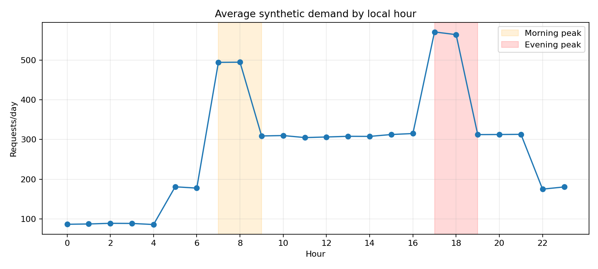
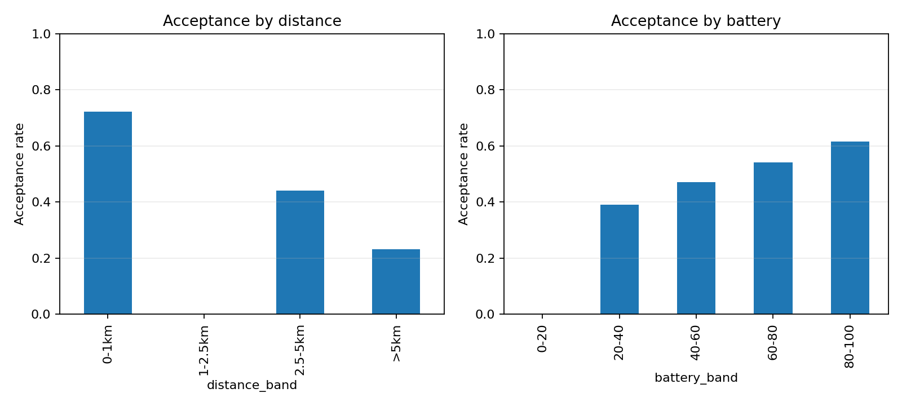
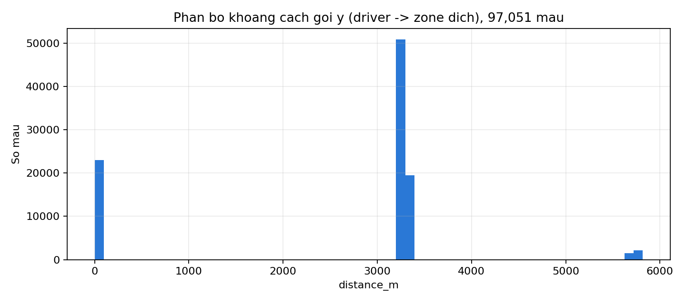

# Tuần 2 — Kiểm tra độ thực tế của dữ liệu giả lập (Data Sanity Check)

> Bổ sung cho [`week2_simulator.md`](week2_simulator.md). Mục tiêu: xác nhận dữ liệu do simulator sinh ra có pattern hợp lý (không phẳng, không ngẫu nhiên thuần tuý) trước khi dùng để train Forecast Engine và Acceptance Probability Model ở Tuần 3.

**Nguồn:** `data/generated/` — 56 ngày, seed `20260717`, 374.269 request, 97.051 mẫu acceptance history.

## 1. Demand theo giờ trong ngày

| Khung giờ | Request/ngày (trung bình) |
|---|---:|
| Đêm (0–5h) | ~4.800–5.000 |
| Sáng sớm (5–7h) | ~9.900–10.100 |
| **Cao điểm sáng (7–9h)** | **~27.700** |
| Giữa ngày (9–16h) | ~17.100–17.600 |
| **Cao điểm chiều (17–19h)** | **~31.600–32.000** |
| Tối muộn (22–23h) | ~9.800–10.100 |

**Nhận định:** đúng 2 đỉnh tan tầm theo config (`morning_peak_multiplier`, `evening_peak_multiplier`), đỉnh chiều cao hơn đỉnh sáng ~1,15 lần — hợp lý so với hành vi đi lại thật.

## 2. Demand theo loại zone

| Zone type | Tổng request (56 ngày) |
|---|---:|
| Residential | 102.811 |
| Office | 89.876 |
| Commercial | 58.067 |
| University | 34.781 |
| Central business | 34.215 |
| Transport hub | 32.462 |
| Peripheral | 22.057 |

**Nhận định:** residential/office dẫn đầu là hợp lý cho nhu cầu đi làm hàng ngày; peripheral thấp nhất khớp với `base_demand_weight` thấp hơn được gán cho zone ngoại ô.

## 3. Tỷ lệ chấp nhận gợi ý (Acceptance) theo khoảng cách và pin

| Khoảng cách | Tỷ lệ chấp nhận | Số mẫu |
|---|---:|---:|
| Cùng zone (0m) | 72,2% | 23.009 |
| Zone lân cận (~3,28km) | 44,0% | 70.363 |
| Zone vòng 2 (~5,7km) | 23,2% | 3.679 |

| Mức pin | Tỷ lệ chấp nhận | Số mẫu |
|---|---:|---:|
| 20–40% | 39,1% | 21.574 |
| 40–60% | 47,2% | 26.291 |
| 60–80% | 54,2% | 37.060 |
| 80–100% | 61,6% | 12.126 |

**Nhận định:** cả 2 chiều đều đơn điệu đúng hướng kỳ vọng (xa hơn/pin thấp hơn → chấp nhận thấp hơn) — cơ chế sinh nhãn trong `generate_acceptance_record()` hoạt động đúng thiết kế.

## 4. Phát hiện: cột `distance_m` bị rời rạc hoá (điểm cần lưu ý)

97.051 mẫu chỉ rơi vào đúng **3 giá trị khoảng cách**:

| Giá trị | Số mẫu | Tỷ trọng |
|---|---:|---:|
| 0 m (cùng zone) | 23.009 | 23,7% |
| 3.135–3.300 m (zone lân cận) | 70.363 | 72,5% |
| 5.610–5.940 m (zone vòng 2) | 3.679 | 3,8% |

**Nguyên nhân:** driver chỉ có toạ độ ở mức **tâm zone** (không phải GPS trong zone), và `_find_driver`/Repositioning Suggester luôn chọn **top-3 tài xế gần nhất** trong bán kính 5km (`candidate_radius_m`). Với lưới 30 zone khá đều, khoảng cách tâm-zone-đến-tâm-zone chỉ nhận một vài giá trị cố định → distance_m trở thành biến gần như **hạng mục (categorical)** thay vì liên tục, dù công thức tính (haversine × 1.3) không sai.

**Tác động:** Acceptance Probability Model vẫn học đúng chiều ảnh hưởng của khoảng cách, nhưng đường cong sẽ là bậc thang 3 điểm thay vì mượt — hơi "giả" hơn so với mô tả trong báo cáo (feature liên tục).

**Khuyến nghị sửa (nếu còn thời gian ở Tuần 2–3):**
1. ~~Sinh vị trí driver bằng toạ độ ngẫu nhiên trong polygon zone (thay vì gán cứng tâm zone) trước khi tính haversine.~~ **Đã sửa** — xem `simulator/geo.py` (`random_point_in_zone`), `simulator/models.py`, `simulator/engine.py`. `distance_m` giờ có 35.608 giá trị khác nhau trên 98.441 mẫu (trước đó chỉ 3 giá trị cố định). Chi tiết kết quả sau khi sửa: [`week3_models.md`](week3_models.md) mục 2.
2. Hoặc mở rộng candidate pool vượt quá top-3 gần nhất để có nhiều mức khoảng cách hơn trong tập train.
3. Nêu rõ giới hạn này trong phần "Giới hạn" của báo cáo cuối (Tuần 6) nếu không kịp sửa — đây là giả lập có kiểm soát, không phải hành vi khoảng cách thật.

## Kết luận chung

Dữ liệu **đủ thực tế để dùng cho Tuần 3** (pattern giờ/zone/pin đúng hướng, không phẳng), ngoại trừ feature khoảng cách trong Acceptance History bị rời rạc hoá do cách sinh vị trí driver ở mức zone — nên ghi nhận là giả định đơn giản hoá có chủ đích, đúng tinh thần mục "Nguồn dữ liệu" của `report.md`.
