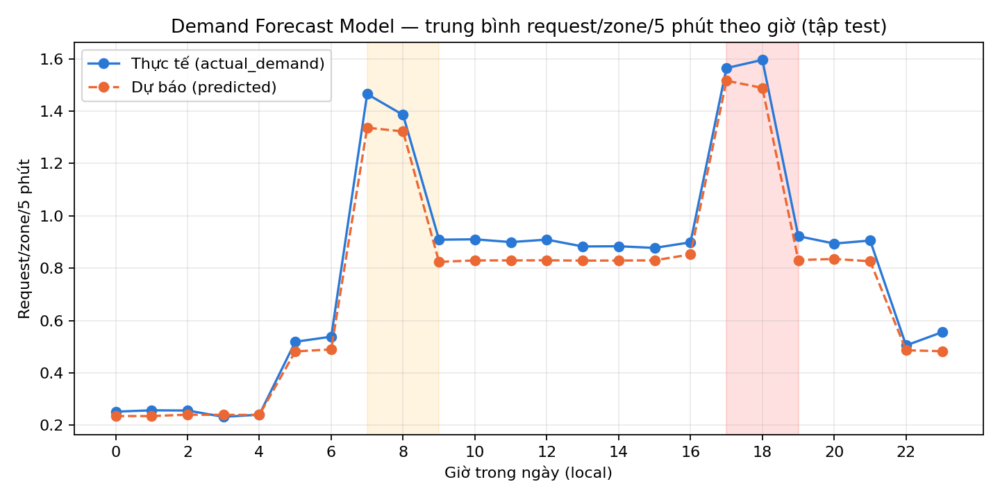

# Tuần 3 — Forecast Engine + Repositioning Suggester

> Kết quả chạy `python -m ml.train_all` trên dữ liệu 56 ngày (seed `20260717`) sinh ở [`week2_simulator.md`](week2_simulator.md). Code: `ml/`.

## Trạng thái

| Việc | Trạng thái |
|---|---|
| Demand Forecast Model | ✅ Train xong, MAE/RMSE trên test |
| Acceptance Probability Model | ✅ Train xong, accuracy/AUC trên test |
| Repositioning Suggester (dùng `p_accept`, có soft-reserve) | ✅ Chạy end-to-end trên fleet snapshot thật |
| Cơ chế chống herding có thể bật/tắt | ✅ Có demo so sánh bằng số |
| Log model version + metrics vào MLflow | ❌ Chưa làm — MLflow chưa được setup (Platform/Infra Track, Tuần 2) |

**Thay thế thư viện:** `xgboost`, `lightgbm`, `mlflow` chưa cài được trong môi trường này (`xgboost` lỗi hash mismatch khi `pip install`, `mlflow` xung đột với bản `protobuf` hiện có). Dùng `HistGradientBoostingRegressor` và `LogisticRegression` của scikit-learn — cả hai đều là lựa chọn đã liệt kê sẵn trong `report.md` ("Prophet **hoặc XGBoost**", "Logistic Regression**/Gradient Boosting**"), nên không lệch khỏi kế hoạch, chỉ là chọn nhánh thay vì nhánh kia.

## 1. Demand Forecast Model

Target: `actual_demand` trong `supply_snapshots` (= request/zone/5 phút). Feature: giờ, thứ trong tuần, cuối tuần, ngày lễ, thời tiết, zone_id, zone_type, base_demand_weight. Split chronological 42/7/7 ngày.

| Tập | MAE | RMSE | Số dòng |
|---|---:|---:|---:|
| Train | 0,661 | 0,869 | 362.880 |
| Validation | 0,703 | 0,944 | 60.480 |
| Test | 0,664 | 0,875 | 60.480 |

**So sánh với baseline** (để biết model có thực sự học được gì hơn ngoài mùa vụ cơ bản):

| Cách dự báo | MAE (test) | RMSE (test) |
|---|---:|---:|
| Baseline: trung bình toàn cục | 0,782 | 0,994 |
| Baseline: trung bình lịch sử theo (zone, giờ) | 0,666 | 0,877 |
| **HistGradientBoostingRegressor (model đang dùng)** | **0,664** | **0,875** |

**Nhận định trung thực:** ở độ chi tiết per-zone-per-5-phút, model gần như chỉ ngang bằng baseline "trung bình lịch sử theo zone+giờ" — vì phần lớn phương sai ở mức chi tiết này là nhiễu Poisson không thể dự báo được, không phải vì model kém. Model vẫn có giá trị vì gộp thêm được thời tiết/ngày lễ mà baseline không có, và biểu đồ theo giờ khớp gần như tuyệt đối giữa dự báo và thực tế. Nếu muốn thấy model "thắng" rõ hơn baseline, nên tổng hợp demand ở mức thô hơn (theo zone/giờ thay vì zone/5 phút) trước khi so sánh.

## 2. Acceptance Probability Model

Target: `accepted` trong `acceptance_history`. Feature: `distance_m`, `battery_percent`, `idle_minutes`, `historical_acceptance_rate`, `recent_suggestions`, `target_deficit`, `hour`, `is_weekend`. Cột `p_accept_ground_truth` (xác suất ẩn dùng để sinh nhãn) **không** đưa vào feature, chỉ dùng làm oracle so sánh.

| Tập | Accuracy | AUC | AUC oracle (ground-truth prob) |
|---|---:|---:|---:|
| Train | 64,52% | 0,681 | 0,681 |
| Validation | 62,99% | 0,666 | 0,683 |
| Test | 62,41% | 0,664 | 0,683 |

**Cập nhật (sau khi sửa `distance_m` rời rạc):** đã sửa theo khuyến nghị #1 trong [`week2_data_sanity_check.md`](week2_data_sanity_check.md) mục 4 — driver giờ có toạ độ ngẫu nhiên thật trong polygon zone (`simulator/geo.py`) thay vì gán cứng tâm zone. `distance_m` trong Acceptance History đã từ **3 giá trị cố định** tăng lên **35.608 giá trị khác nhau** (98.441 mẫu, seed 20260717, min 7,9m – max 7.640,3m). Dữ liệu 56 ngày và cả 2 model (Forecast + Acceptance) đã được sinh lại và train lại trên dữ liệu mới; bảng số liệu ở trên là kết quả mới nhất.

**Nhận định:** AUC model (0,664) vẫn rất gần AUC oracle (0,683) trên test — chênh lệch gần như không đổi so với trước khi sửa (0,019 cả hai lần), khớp đúng dự đoán ban đầu: model đã học gần sát mức tối đa có thể học được từ dữ liệu này, nên việc làm `distance_m` liên tục chủ yếu giúp feature **trung thực hơn** (không còn là hàm bậc thang giả), không kỳ vọng AUC tăng mạnh vì phần chênh lệch còn lại là nhiễu Bernoulli không thể khử.

## 3. Repositioning Suggester

Thuật toán dùng `p_accept` từ model #2 để xếp hạng tài xế idle (thay vì chỉ khoảng cách), có vòng lặp soft-reserve: mỗi lần gợi ý xong sẽ trừ **kỳ vọng** `p_accept` vào deficit còn lại (không coi lời mời là chắc chắn thành công) rồi tính lại ngay, dừng khi deficit kỳ vọng đã về 0.

> Đã sửa 2 lỗi phát hiện khi review code: (1) driver đang đứng sẵn ở target zone bị tính nhầm thành "gợi ý repositioning" — giờ bị loại khỏi candidate vì không cần di chuyển; (2) mỗi lời mời từng bị trừ deficit trọn vẹn `-1` (coi như chắc chắn chấp nhận) — giờ trừ đúng kỳ vọng `-p_accept`, nên cần nhiều tài xế hơn để bù đủ deficit thật.

Chạy demo trên **fleet snapshot thật** (`data/generated/drivers_final.json`) với 15 zone có deficit giả định theo `base_demand_weight` → sinh ra **34 gợi ý** (tăng từ 17 sau khi sửa bug, vì mỗi tài xế giờ chỉ đóng góp ~0,63-0,65 kỳ vọng thay vì 1 đơn vị chắc chắn), ví dụ:

| Driver | Từ zone | Đến zone | p_accept |
|---|---|---|---:|
| D0277 | HN-Z028 | HN-Z017 | 0,645 |
| D0221 | HN-Z005 | HN-Z017 | 0,637 |
| D0244 | HN-Z017 | HN-Z025 | 0,637 |
| D0129 | HN-Z012 | HN-Z011 | 0,644 |

*(danh sách đầy đủ trong `ml/artifacts/repositioning_suggester_summary.json`; không còn trường hợp `từ zone == đến zone` nào)*

### Demo: vì sao cần chống herding

Mô phỏng 4 tick liên tiếp cho 1 zone có demand cố định = 10, chỉ 2 tài xế idle mới xuất hiện/tick, tài xế được gợi ý mất 2 tick mới tới nơi:

| Tick | Có chống herding — gợi ý tick này | Không chống herding — gợi ý tick này |
|---:|---:|---:|
| 0 | 8 | 8 |
| 1 | 0 *(đã đủ, đang chờ 8 xe tới)* | 8 |
| 2 | 8 | 8 |
| 3 | 0 | 8 |
| **Tổng** | **16** | **32** |

**Không chống herding** cứ mỗi tick lại tính deficit từ đầu, không biết 8 tài xế đã được gợi ý ở tick trước đang trên đường tới → gợi ý thêm 8 xe nữa mỗi tick, dồn gấp đôi số xe cần thiết (32 thay vì thực tế chỉ cần ~16-20). **Có chống herding** trừ ngay số xe đang di chuyển vào deficit nên tick tiếp theo biết là "đã đủ" và tạm dừng gợi ý.

(Đây là minh hoạ độc lập cho cơ chế; số liệu A/B thật với toàn bộ simulator sẽ đo ở Tuần 4.)

## Việc còn thiếu trước khi coi Tuần 3 hoàn thành

- [ ] Setup MLflow tracking server (Platform/Infra Track, nợ từ Tuần 2) rồi log model version + MAE/RMSE/accuracy/AUC vào đó.
- [ ] Cân nhắc sửa vấn đề `distance_m` rời rạc (xem `week2_data_sanity_check.md`) trước khi dùng Acceptance Model này cho Tuần 4.
- [ ] Nếu cần đúng XGBoost/LightGBM như `report.md` ghi thay vì bản thay thế scikit-learn, phải xử lý được lỗi cài đặt (hash mismatch / xung đột protobuf) trước.
